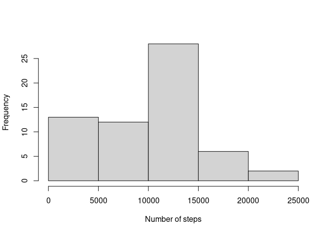
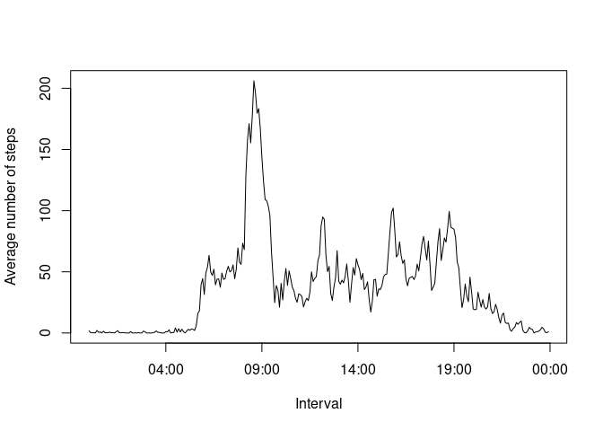
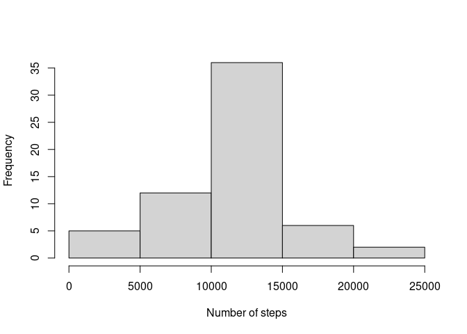
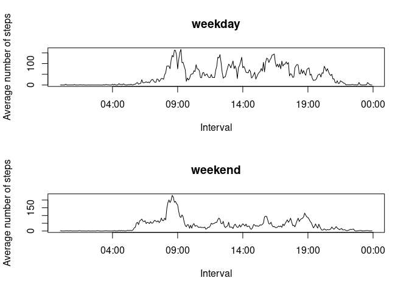

## Loading and preprocessing the data

```r
if (!file.exists("activity.csv")) {unzip("activity.zip")}
data=read.csv("activity.csv")
data$date=as.Date(data$date)
data$interval=strptime(sprintf("%04d",data$interval),format="%H%M")
```

## What is mean total number of steps taken per day?
First, we calculate the total number of steps per day:

```r
library(dplyr)
```

```
## 
## Attaching package: 'dplyr'
```

```
## The following objects are masked from 'package:stats':
## 
##     filter, lag
```

```
## The following objects are masked from 'package:base':
## 
##     intersect, setdiff, setequal, union
```

```r
totalsteps=data %>% group_by(date) %>% summarise(totalsteps=sum(steps,na.rm=TRUE),.groups='drop')
```

We create a histogram of the total number of steps taken each day

```r
hist(totalsteps$totalsteps,xlab="Number of steps",main="")
```

<!-- -->

The mean of the total number of steps taken per day is:

```r
with(totalsteps,mean(totalsteps,na.rm=TRUE))
```

```
## [1] 9354.23
```
and he median of the total number of steps taken per day is:

```r
with(totalsteps,median(totalsteps,na.rm=TRUE))
```

```
## [1] 10395
```

## What is the average daily activity pattern?
Let's plot the average number of steps per 5-minute interval:

```r
stepsperinterval=data %>% group_by(interval) %>% summarise(stepsperinterval=mean(steps,na.rm=TRUE),.groups='drop')
plot(stepsperinterval,xlab="Interval",ylab="Average number of steps",type="l")
```

<!-- -->
We see that the maximum number of steps occurs at the 5-minute time interval starting at:

```r
substr(stepsperinterval$interval[stepsperinterval$stepsperinterval==max(stepsperinterval$stepsperinterval)],12,16)
```

```
## [1] "08:35"
```

## Imputing missing values
The total number of cases with missing values is:

```r
sum(is.na(data$steps))
```

```
## [1] 2304
```
We would like to fill in the missing values with an estimate. Let us consider the average standard deviation for the average number of steps per day:

```r
mean((data %>% group_by(date) %>% summarise(stddev=sd(steps,na.rm=TRUE),.groups='drop'))$stddev,na.rm=TRUE)
```

```
## [1] 105.1223
```
and of the average number of steps per interval:

```r
mean((data %>% group_by(interval) %>% summarise(stddev=sd(steps,na.rm=TRUE),.groups='drop'))$stddev,na.rm=TRUE)
```

```
## [1] 82.97991
```
The latter is smaller, so we will fill in the missing values with the corresponding mean number of steps per interval:

```r
fillindata=data %>% group_by(interval) %>% mutate(stepsperinterval=mean(steps,na.rm=TRUE))
fillindata$steps[is.na(fillindata$steps)]=fillindata$stepsperinterval[is.na(fillindata$steps)]
```
We create a histogram of the total number of steps taken each day using the fill-in dataset

```r
fillintotalsteps=fillindata %>% group_by(date) %>% summarise(totalsteps=sum(steps,na.rm=TRUE),.groups='drop')
hist(fillintotalsteps$totalsteps,xlab="Number of steps",main="")
```

<!-- -->

The mean of the total number of steps taken per day now is:

```r
with(fillintotalsteps,mean(totalsteps,na.rm=TRUE))
```

```
## [1] 10766.19
```
and he median of the total number of steps taken per day now is:

```r
with(fillintotalsteps,median(totalsteps,na.rm=TRUE))
```

```
## [1] 10766.19
```
We can see that these values have increased slightly from the mean and median computed before without filling-in the missing values. The presence of missing data was reducing the total daily number of steps.

## Are there differences in activity patterns between weekdays and weekends?
Let's create a new factor variable to differentiate between weekdays and weekend days

```r
fillindata=mutate(fillindata,weekend=factor((weekdays(date)=="Saturday"|weekdays(date)=="Sunday"),labels=c("weekend","weekday")))
```

Let's create a new factor variable to differentiate between weekdays and weekend days

```r
fillindata=mutate(fillindata,weekend=factor((weekdays(date)=="Saturday"|weekdays(date)=="Sunday"),labels=c("weekend","weekday")))
```
and calculate and plot the average number of steps per interval for weekdays and weekend days separately:

```r
stepsperintervalweeekend=fillindata %>% group_by(interval,weekend) %>% summarise(stepsperinterval=mean(steps,na.rm=TRUE),.groups='drop')
par(mfrow=c(2,1))
with(stepsperintervalweeekend,plot(interval[weekend=="weekday"],stepsperinterval[weekend=="weekday"],type="l",xlab="Interval",ylab="Average number of steps",main="weekday"))
with(stepsperintervalweeekend,plot(interval[weekend=="weekend"],stepsperinterval[weekend=="weekend"],type="l",xlab="Interval",ylab="Average number of steps",main="weekend"))
```

<!-- -->

